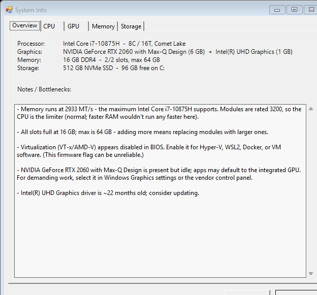

# System Info

A small, zero-install **Windows system-information + bottleneck analyzer**, written in PowerShell. It reports your **processor, memory, graphics, and storage** — and, the useful part, calls out **bottlenecks**: where one part of the system is holding another back, and what (if anything) you can do about it.

Runs as a tabbed window or as plain console text. No dependencies, no installer — two files.



## What it shows

- **Processor** — model, cores/threads, base clock, L2/L3 cache, socket, 64-bit, virtualization on/off, microarchitecture/codename, and the max memory speed the CPU supports.
- **Memory** — installed amount and speed (rated vs. actually running), per-DIMM detail (size, maker, part #), slots used/free, and the motherboard's max capacity.
- **Graphics** — every GPU, integrated vs. discrete, **accurate VRAM** (read from the registry, since Windows' usual field caps at ~4 GB), driver version/age, and active/idle status.
- **Storage** — physical disks (NVMe SSD / SATA SSD / HDD, size, health, which is the boot drive) and volumes (drive letters, free space).
- **Firmware & Security** — BIOS version/date, UEFI vs. Legacy, **Secure Boot** on/off, and **TPM** presence/version, rolled up into a **Windows 11 readiness** checklist. All read without admin (best-effort); the CPU-model requirement points you to Microsoft's supported-CPU list rather than guessing it.
- **Notes / Bottlenecks** — e.g. *memory capped by the CPU*, *single-channel RAM limiting you*, *virtualization disabled in BIOS*, *discrete GPU idle*, *GPU driver N months old*, *Windows on a mechanical hard drive*, *drive low on space*.
- **Upgrade Advisor** — turns the detected bottlenecks into a ranked *what-to-do-first* plan: free BIOS/driver/config fixes first (enable XMP, enable virtualization, update the GPU driver, free up disk space, switch off Power saver), then hardware upgrades (SSD, dual-channel RAM, replace a worn battery), each tagged with a coarse High/Med/Low impact. Pure synthesis of the data above — no invented prices, percentages, or product names.

## Running it

**Easiest:** double-click **`SystemInfo.cmd`** — the window opens.

**Console (text) mode:**

```
powershell.exe -ExecutionPolicy Bypass -File Show-SystemInfo.ps1 -Console
```

To run it on another PC, copy **`Show-SystemInfo.ps1`** and **`SystemInfo.cmd`** into the same folder (keep both names). That's all.

### Requirements

- Windows 10 / 11. No install, no admin rights, no internet.
- Uses the built-in Windows PowerShell (the launcher uses it so the window and clipboard work).

> If Windows marks the downloaded files as blocked (Mark-of-the-Web), the `.cmd`'s `-ExecutionPolicy Bypass` covers the `.ps1`; if a SmartScreen prompt appears, choose **More info → Run anyway**, or right-click each file → Properties → **Unblock**.

## A note on honesty

Some facts simply aren't stored on the PC. Rather than guess, the tool either derives them transparently or says so — it never fabricates a number:

- **Motherboard max RAM *speed*** and **CPU codename** aren't in firmware; they're derived from the CPU model at a **generation level** (accurate for the vast majority, not a per-chip database).
- **GPU VRAM** is read from the registry because the common WMI field caps at ~4 GB (otherwise a 6 GB card shows as 4 GB).
- **NVMe** drives behind Intel RST report their bus as "RAID" — detected from the disk name instead.
- The **virtualization** firmware flag can be unreliable, and is labelled as such.
- **Boost clock**, instruction-set flags, and GPU utilisation/temperatures aren't exposed by Windows, so they aren't shown (rather than guessed).

## Development

- `tests/SystemInfo.Tests.ps1` — zero-dependency unit suite (~148 tests):

  ```
  pwsh -File tests/SystemInfo.Tests.ps1
  ```

- `tests/GuiSmoke.ps1` — headless WinForms structure check.
- Design specs: `docs/superpowers/specs/`.

**Architecture:** thin collectors (CIM / registry) → pure per-subsystem report builders (`New-CpuReport`, `New-MemoryReport`, `New-GpuReport`, `New-StorageReport`) → one `New-SystemReport` → a shared `Get-SystemInsights` bottleneck engine → renderers (console + tabbed WinForms). Adding a subsystem = a collector, a `New-<X>Report`, a `Get-<X>Insights`, and a little wiring.
